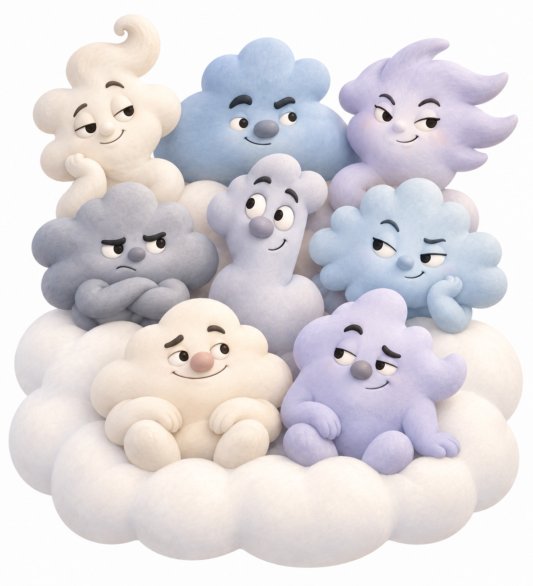

# ☁️ [WHS] Kintoun SecOps Project ☁️

AWS 기반 클라우드 침해사고 대응 및 SecOps 인프라 구축 프로젝트

&nbsp;

## 👥 Team Members 👥

| Name | GitHub | Role |
|:---:|:---:|:---:|
| 조준환 | **@jjh4450** | 🎯 Project Manager |
| 박진혁 | **@dndlftls** | ☁️ AWS Infrastructure |
| 장혜리 | **@wkdgPfl** | ☁️ AWS Infrastructure |
| 박윤하 | **@Park123r** | ⚔️ Attack Simulation |
| 김태형 | **@taehyung-99** | 🔍 Incident Analysis & Response |
| 이재원 | **@acr0209-eng** | 🔍 Incident Analysis & Response |
| 양혜민 | **@hhmmm12** | 📋 Compliance |
| 오병은 | **@susan0606** | 📋 Compliance |

## 🛠️ Tech Stack 🛠️
| Division | Tools & Tech |
|:---:|:---:|
| **CSP** ||
| **IaC** ||
| **CI/CD** ||
| **XDR/SIEM** ||
| **DFIR** ||
| **Offensive OS** ||